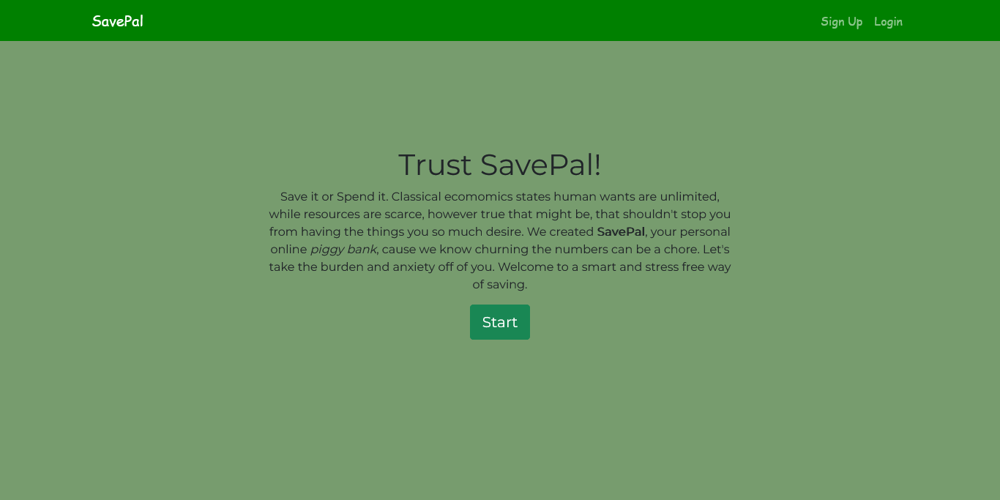

# SavePal
SavePal is a personal online piggy bank. Users can sign up, provide information on their monthly income and expenditure, the desired item they need to save up for, and its price. SavePal performs the necessary calculations, adding in 2% miscellaneous expenses and viola! *the amount savable per day and the number of days to save for*
 
 

 
 

## Technologies
* Python
* HTML
* Bootstrap
* Django

## To Start 
<ol>
    <li>Clone this repo</li>
    <li>Install all libraries contained in the Pipfile</li>
    <li>Run the server!</li>
    <li>Sign Up!</li>
    <li>Save Up!</li>
<ol>